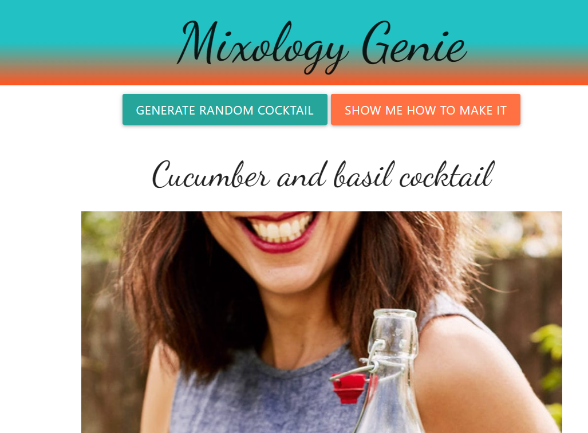

# Mixology-Genie

## Description
This is an app where users can generate random cocktails.

## Installation
To acsess the webage you can click on the following link.

## Usage
This website is designed to generate a random cocktail when the button is pushed. Once the cocktail is generated then the image is with the cockatail name appear. If the user wants to proceed with the randomized drink the show me how button allows the user to view a video of how to make the drink. If not the user can simply generate a new cocktail.

## Credits
This was a collaborated effort with Barrett Mistele, Hunter Thompson, Urie Williams, Paul Price, Robel Abraha. 

## License

Please refer to the LICENSE in the repo.

## Deployed Application

## Screenshot of Application

